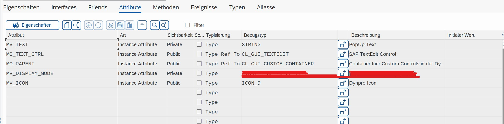
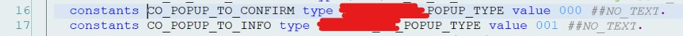
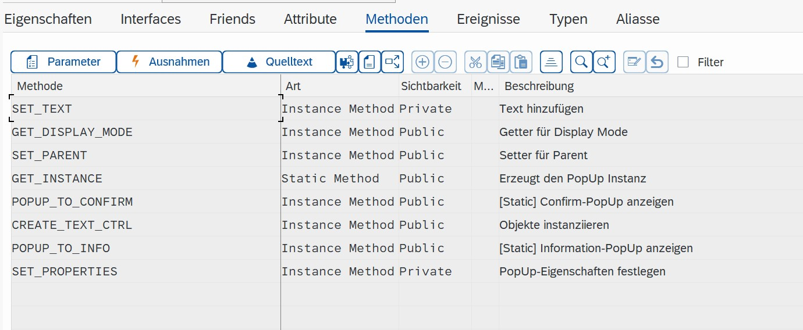

# CL_GUI_TEXTEDIT_POPUP
CL_GUI_TEXTEDIT_POPUP 

- [**Attributes**](#Attributes)
  - [MV_TEXT](#MV_TEXT)
  - [MO_TEXT_CTRL](#MO_TEXT_CTRL)
  - [MO_PARENT](#MO_PARENT)
  - [MV_DISPLAY_MODE](#MV_DISPLAY_MODE)
  - [MV_ICON](#MV_ICON)
- [**Methods**](#Methods)
  - [SET_TEXT](#SET_TEXT)
  - [GET_DISPLAY_MODE](#GET_DISPLAY_MODE)
  - [SET_PARENT](#SET_PARENT)
  - [GET_INSTANCE](#GET_INSTANCE)
  - [POPUP_TO_CONFIRM](#POPUP_TO_CONFIRM)
  - [CREATE_TEXT_CTRL](#CREATE_TEXT_CTRL)
  - [POPUP_TO_INFO](#POPUP_TO_INFO)
  - [SET_PROPERTIES](#SET_PROPERTIES)

# Attributes 

MV_TEXT	        Instance Attribute	Private	Type          STRING	                  PopUp-Text
MO_TEXT_CTRL	  Instance Attribute	Public	Type Ref To	  CL_GUI_TEXTEDIT	          SAP TextEdit Control
MO_PARENT	      Instance Attribute	Public	Type Ref To	  CL_GUI_CUSTOM_CONTAINER	  Container fuer Custom Controls in der Dynpro Area
MV_DISPLAY_MODE	Instance Attribute	Private	Type          Z_POPUP_TYPE	            PopUp-Type (Constants)
MV_ICON	        Instance Attribute	Public	Type	        ICON_D	                  Dynpro Icon

   
  
   

   
  
   

<a href="#top">⬆️ back to top</a>

# Methods 

   
  
   

<a href="#top">⬆️ back to top</a>

## SET_TEXT

## GET_DISPLAY_MODE

## SET_PARENT

## GET_INSTANCE

## POPUP_TO_CONFIRM

## CREATE_TEXT_CTRL

## POPUP_TO_INFO

## SET_PROPERTIES

 
<a href="https://help.sap.com/doc/abapdocu_cp_index_htm/CLOUD/en-US/index.htm?file=abencds_arithmetic_expression_v2.htm">SAP Docu</a>
 
 

<a href="#top">⬆️ back to top</a>

