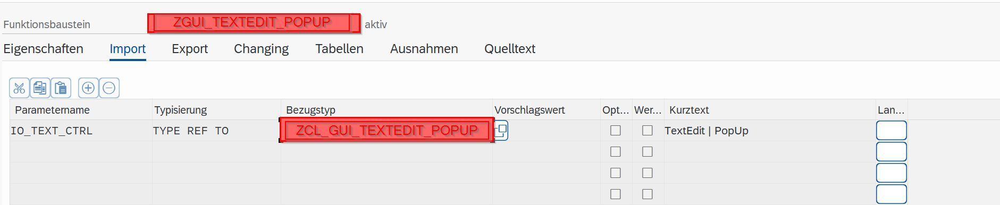
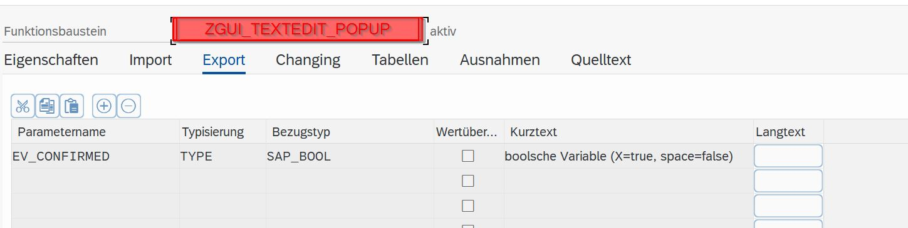
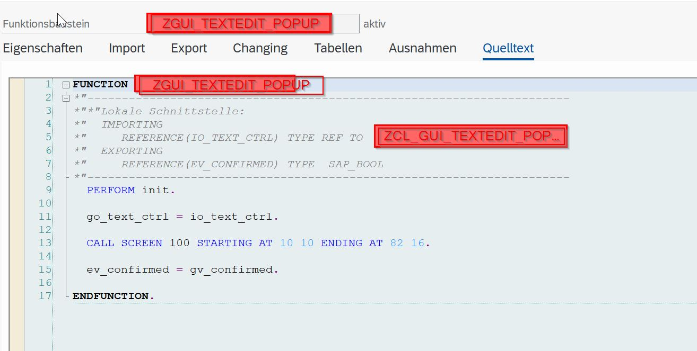
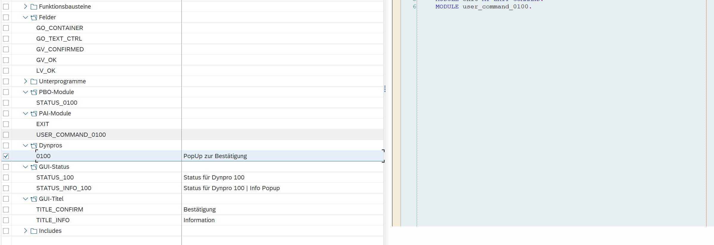
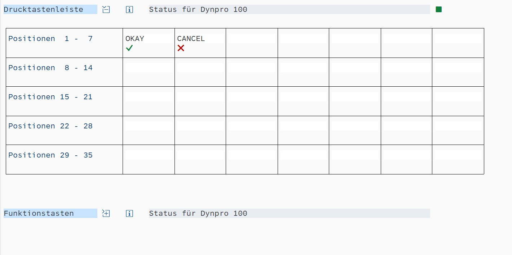
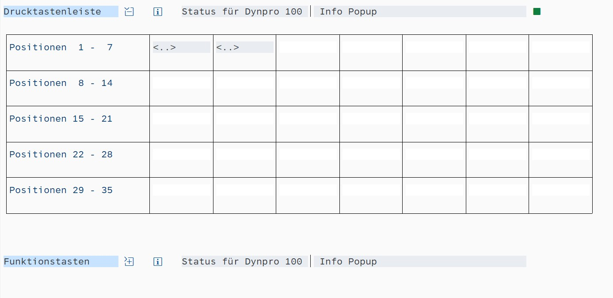
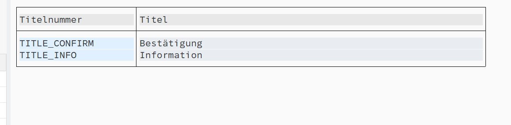
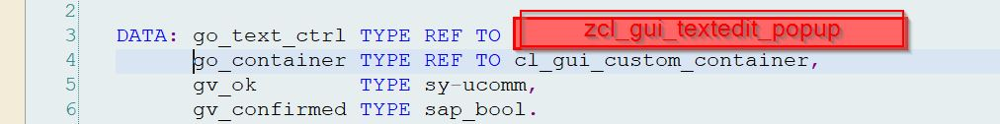
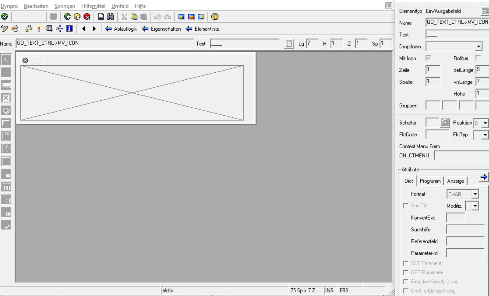

<a name="top"></a>

# CL_GUI_TEXTEDIT_POPUP
CL_GUI_TEXTEDIT_POPUP 

- [**Attributes**](#Attributes)
  - [MV_TEXT](#MV_TEXT)
  - [MO_TEXT_CTRL](#MO_TEXT_CTRL)
  - [MO_PARENT](#MO_PARENT)
  - [MV_DISPLAY_MODE](#MV_DISPLAY_MODE)
  - [MV_ICON](#MV_ICON)
- [**Methods**](#Methods)
  - [SET_TEXT](#SET_TEXT)
  - [GET_DISPLAY_MODE](#GET_DISPLAY_MODE)
  - [SET_PARENT](#SET_PARENT)
  - [GET_INSTANCE](#GET_INSTANCE)
  - [POPUP_TO_CONFIRM](#POPUP_TO_CONFIRM)
  - [CREATE_TEXT_CTRL](#CREATE_TEXT_CTRL)
  - [POPUP_TO_INFO](#POPUP_TO_INFO)
  - [SET_PROPERTIES](#SET_PROPERTIES)
- [**Function**](#Function)


# Attributes 

MV_TEXT	        Instance Attribute	Private	Type          STRING	                  PopUp-Text
MO_TEXT_CTRL	  Instance Attribute	Public	Type Ref To	  CL_GUI_TEXTEDIT	          SAP TextEdit Control
MO_PARENT	      Instance Attribute	Public	Type Ref To	  CL_GUI_CUSTOM_CONTAINER	  Container fuer Custom Controls in der Dynpro Area
MV_DISPLAY_MODE	Instance Attribute	Private	Type          Z_POPUP_TYPE	            PopUp-Type (Constants)
MV_ICON	        Instance Attribute	Public	Type	        ICON_D	                  Dynpro Icon

  <br>
  
  <br>

  <br>
  
  <br>

<p align="right"><a href="#top">⬆️ back to top</a></p>

# Methods 

SET_TEXT	          Instance Method	    Private	                               	Text hinzufügen
GET_DISPLAY_MODE	  Instance Method	    Public	                               	Getter für Display Mode
SET_PARENT	        Instance Method	    Public	                               	Setter für Parent
GET_INSTANCE	      Static Method	      Public	                               	Erzeugt den PopUp Instanz
POPUP_TO_CONFIRM	  Instance Method	    Public	                               	[Static] Confirm-PopUp anzeigen
CREATE_TEXT_CTRL	  Instance Method	    Public	                               	Objekte instanziieren
POPUP_TO_INFO	      Instance Method	    Public	                               	[Static] Information-PopUp anzeigen
SET_PROPERTIES	    Instance Method    	Private	                               	PopUp-Eigenschaften festlegen


  <br>
  
  <br>

<p align="right"><a href="#top">⬆️ back to top</a></p>


## SET_TEXT

```abap
  METHOD set_text.

    mo_text_ctrl->set_textstream( text  =   mv_text ).

  ENDMETHOD.
```

  <p align="right"><a href="#top">⬆️ back to top</a></p>

## GET_DISPLAY_MODE

```abap
  method GET_DISPLAY_MODE.

    rv_result = mv_display_mode.

  endmethod.
```

<p align="right"><a href="#top">⬆️ back to top</a></p>


## SET_PARENT

```abap
  method SET_PARENT.

    mo_parent = io_parent.

  endmethod.
```


<p align="right"><a href="#top">⬆️ back to top</a></p>


## GET_INSTANCE

```abap
  METHOD GET_INSTANCE.

    ro_obj = NEW ZCL_GUI_TEXTEDIT_POPUP( ).
    ro_obj->mv_text = iv_text.
    ro_obj->mv_icon = iv_icon.

  ENDMETHOD.
```

<p align="right"><a href="#top">⬆️ back to top</a></p>

## POPUP_TO_CONFIRM

```abap
  METHOD POPUP_TO_CONFIRM.

    mv_display_mode = 000.

    CALL FUNCTION 'ZGUI_TEXTEDIT_POPUP'
      EXPORTING
        io_text_ctrl = me
      IMPORTING
        ev_confirmed = rv_value.


  ENDMETHOD.
```

  <p align="right"><a href="#top">⬆️ back to top</a></p>

## CREATE_TEXT_CTRL

```abap
  METHOD CREATE_TEXT_CTRL.

    mo_text_ctrl = NEW cl_gui_textedit(
          wordwrap_mode              = cl_gui_textedit=>wordwrap_at_windowborder
          wordwrap_position          = 72
          parent                     =  mo_parent   ).

    set_properties( ).
    set_text( ).

  ENDMETHOD.
```

  <p align="right"><a href="#top">⬆️ back to top</a></p>

## POPUP_TO_INFO

```abap
  METHOD POPUP_TO_INFO.

    mv_display_mode = 001.

    CALL FUNCTION 'ZGUI_TEXTEDIT_POPUP'
      EXPORTING
        io_text_ctrl = me.


  ENDMETHOD.
```

  <p align="right"><a href="#top">⬆️ back to top</a></p>

## SET_PROPERTIES

```abap
METHOD SET_PROPERTIES.

  mo_text_ctrl->set_toolbar_mode( toolbar_mode     = CL_GUI_TEXTEDIT=>FALSE ).
  mo_text_ctrl->set_statusbar_mode( statusbar_mode = CL_GUI_TEXTEDIT=>FALSE ).
  mo_text_ctrl->set_readonly_mode(  readonly_mode  = cl_gui_textedit=>TRUE ).
  mo_text_ctrl->set_height( height  =   5 ).
  mo_text_ctrl->set_width( width = 70 ).
*  mo_text_ctrl->set_

ENDMETHOD.
```

  <p align="right"><a href="#top">⬆️ back to top</a></p>


# Function

```abap
FUNCTION ZGUI_TEXTEDIT_POPUP .
*"----------------------------------------------------------------------
*"*"Lokale Schnittstelle:
*"  IMPORTING
*"     REFERENCE(IO_TEXT_CTRL) TYPE REF TO  ZCL_GUI_TEXTEDIT_POPUP
*"  EXPORTING
*"     REFERENCE(EV_CONFIRMED) TYPE  SAP_BOOL
*"----------------------------------------------------------------------
  PERFORM init.

  go_text_ctrl = io_text_ctrl.

  CALL SCREEN 100 STARTING AT 10 10 ENDING AT 82 16.

  ev_confirmed = gv_confirmed.

ENDFUNCTION.
```
  <br>
    <br>
      <br>
      
```abap
PROCESS BEFORE OUTPUT.
  MODULE status_0100.
*
PROCESS AFTER INPUT.
  MODULE exit AT EXIT-COMMAND.
  MODULE user_command_0100.
```
  <br>
    <br>
      <br>

```abap
MODULE status_0100 OUTPUT.

  go_container = NEW cl_gui_custom_container( container_name = 'CNT_TEXT' ).
  go_text_ctrl->set_parent( go_container ).
  go_text_ctrl->create_text_ctrl( ).

  IF go_text_ctrl->get_display_mode( ) EQ 000.
    SET TITLEBAR  'TITLE_CONFIRM'.
    SET PF-STATUS 'STATUS_100'.
  ELSE.
    SET TITLEBAR  'TITLE_INFO'.
    SET PF-STATUS 'STATUS_INFO_100'.
  ENDIF.
ENDMODULE.
```
  <br>
    <br>
      <br>

```abap
*----------------------------------------------------------------------*
*&---------------------------------------------------------------------*
*&      Module  USER_COMMAND_0100  INPUT
*&---------------------------------------------------------------------*
*       text
*----------------------------------------------------------------------*
MODULE user_command_0100 INPUT.

  DATA: lv_ok TYPE sy-ucomm.
  lv_ok = gv_ok.

  CLEAR gv_ok.

  IF lv_ok EQ 'OKAY'.
    gv_confirmed = abap_true.
    LEAVE TO SCREEN 0.
  ENDIF.


ENDMODULE.

MODULE exit INPUT.
  LEAVE TO SCREEN 0.
ENDMODULE.

```

  <br>
  
  <br>


  <br>
  
  <br>


  <br>
  
  <br>

  <br>
  
  <br>

  <br>
  
  <br>

  <br>
  
  <br>

  <br>
  
  <br>

  <br>
  
  <br>

  <br>
  
  <br>


<p align="right"><a href="#top">⬆️ back to top</a></p>


